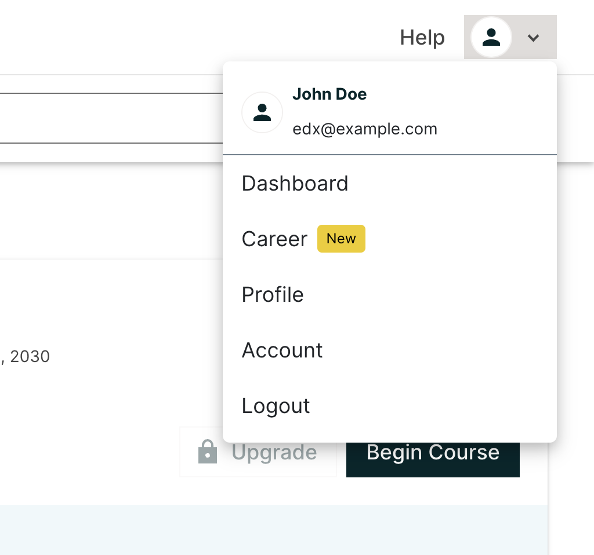
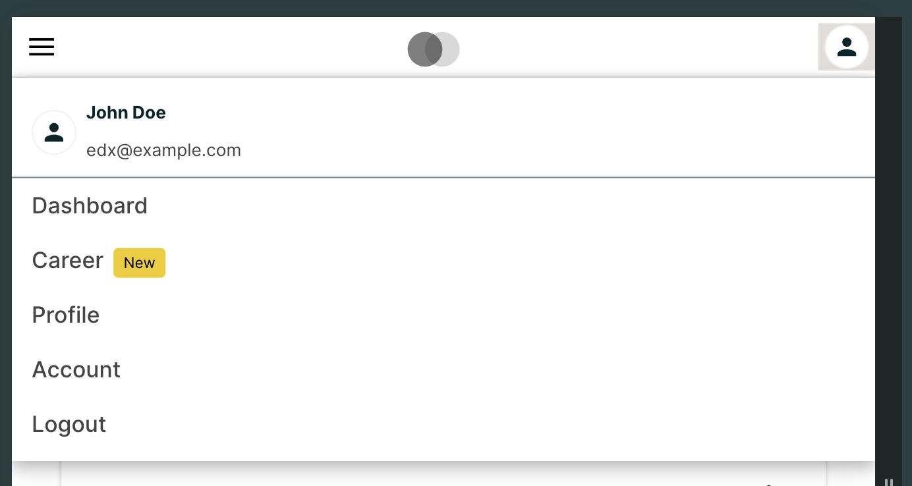
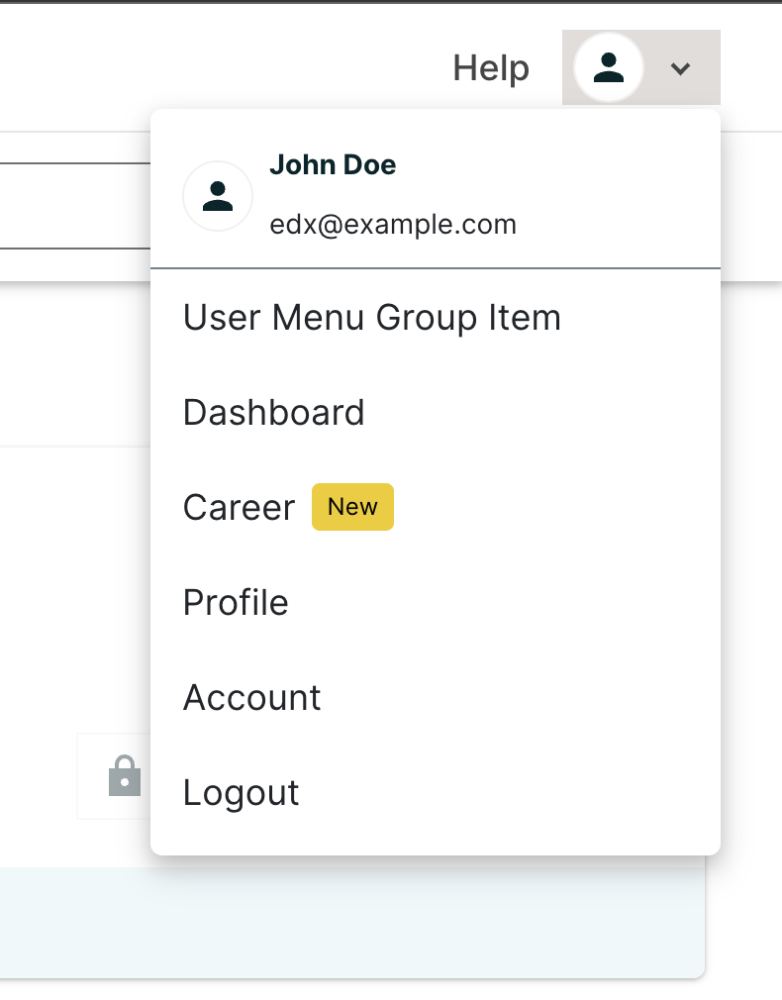
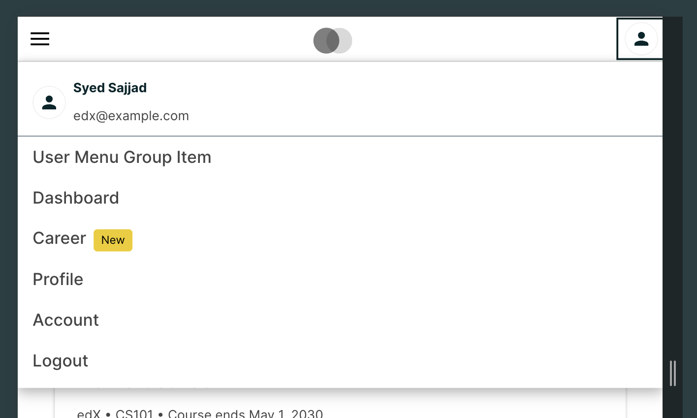

# Header User Menu Group Slot

### Slot ID: `header_user_menu_group_item_slot`

## Description

This slot allows you to insert a user menu item into a group within the header's user menu for both desktop and mobile screens.

Note: Ensure the slot is provided with appropriate JSX that can render smoothly on both desktop and mobile screens.

## Example

The following ``env.config.jsx`` demonstrates how to insert a user menu item into a group within the header's user menu
for both desktop and mobile screens.

**Default Behaviour:**

Desktop:


Mobile:


**Inserted a user menu group:**

Desktop:


Mobile:


```jsx
import { DIRECT_PLUGIN, PLUGIN_OPERATIONS } from '@openedx/frontend-plugin-framework';
import { breakpoints, Dropdown, useWindowSize } from '@openedx/paragon';

const config = {
  pluginSlots: {
    header_user_menu_group_slot: {
      plugins: [
        {
          // Insert some user menu group item
          op: PLUGIN_OPERATIONS.Insert,
          widget: {
            id: 'user_menu_group',
            type: DIRECT_PLUGIN,
            RenderWidget: () => {
              const { width } = useWindowSize();
              const isMobile = width <= breakpoints.small.maxWidth;
              if (!isMobile) {
                return (
                  <Dropdown.Item as="a" href="#">
                    User Menu Group Item
                  </Dropdown.Item>
                );
              }
              return (
                <li className="nav-item">
                  <a href="#" className="nav-link">
                    User Menu Group Item
                  </a>
                </li>
              );
            },
          },
        },
      ],
    },
  },
}

export default config;
```
